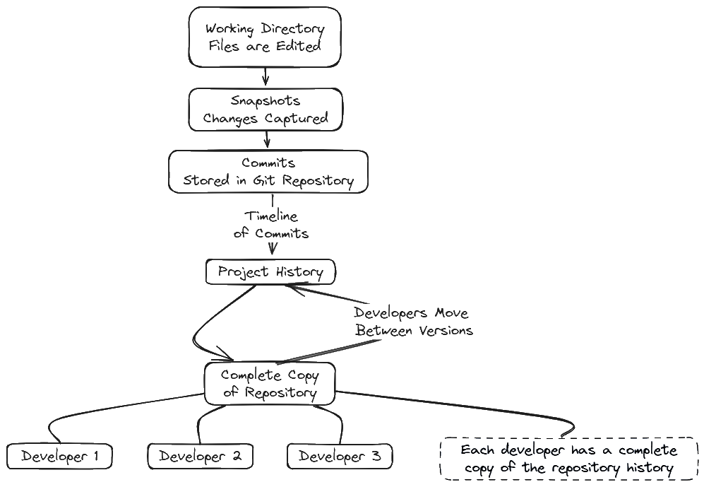

# What is Git?

Git is a **distributed version control system** used to track changes in source code over time.

It allows developers to:

* Save versions of their work
* Go back to previous states
* Work on the same project without overwriting each other

### Why Git exists?

Before Git, teams shared code manually, which caused:

* Lost work
* Broken files
* No history


Git solves this by keeping a **full history** of changes and managing collaboration safely.


### How Git works?

Git works by:&#x20;

* Taking snapshots of your project
* Storing them as commits
* Letting you move between versions

Every developer has a **complete copy** of the project history.

<figure><picture><source srcset="../.gitbook/assets/Diagrame_GitVsGithub_lightmod.png" media="(prefers-color-scheme: dark)"></picture><figcaption>
Git tracks project history using commits and branches.
</figcaption></figure>


**Git is not GitHub**

* Git is a **tool**.
* GitHub is a **platform** built on top of Git.



You can use Git without GitHub, but GitHub makes collaboration easier.


### When you use Git?

You use Git when you:

* Build applications
* Work in teams
* Experiment without breaking code
* Want a safety net for your changes


In modern development, Git is a **core skill**, not an optional one.


[Learn more →](https://www.w3schools.com/git/git_intro.asp?remote=github)
